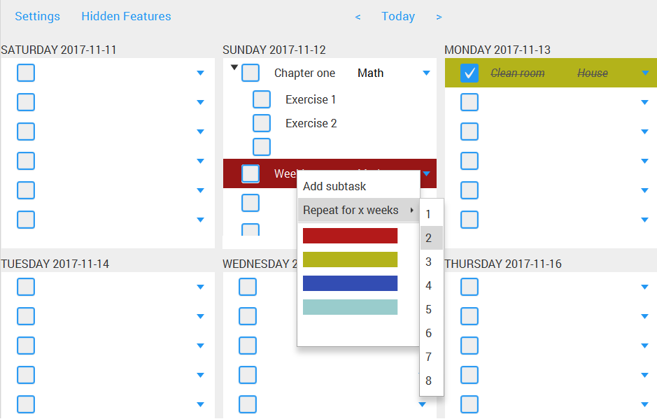

# plep
Plepping is the new planning.

Plep works like a real agenda, but with the advantages of your Windows computer.

[Download stable version v1.2.2.](https://github.com/deltadak/plep/blob/master/releases/plep_v1.2.2.jar?raw=true)

[Download beta version v2.0.0-beta](https://github.com/deltadak/plep/blob/master/releases/plep_v2.0.0-beta.jar?raw=true)

[Download the experimental windows installer for v1.2.1.](https://github.com/deltadak/plep/blob/master/releases/setup/setup_plep_v1.2.1.exe?raw=true)

Find the latest debug build [here](https://github.com/deltadak/plep/blob/master/out/artifacts/plep_jar/plep.jar?raw=true).

We try to adhere to [Semantic Versioning](http://semver.org/).

## Features
+ Drag and drop
+ Custom labels
+ Subtasks
+ Custom colours
+ Repeat for x weeks
+ Customize number of days and columns
+ Turn pages by a custom amount of days
+ Deletion and undoing deletion
+ Plep will remember all deleted tasks until you close it.

Note: The first time plep is ran, it will create a database file in the folder where plep.jar is stored. You can backup this if you don't want to lose your data.

## Screenshot of v2.0.0

# Settings of v2.0.0

## Instructions for building from source in IntelliJ
This application works with a database, so you need to add the sqlite library by going to project structure -> libaries -> add new one and then selecting the file located at something like C:\Users\username\\.IntelliJIdea2016.2\config\jdbc-drivers\sqlite-jdbc-3.8.11.2.jar
Then you go to view -> tool windows -> database and follow the instructions to add an SQLite data source.

## [Javadoc](http://htmlpreview.github.io/?https://github.com/deltadak/plep/blob/master/Javadoc/index.html)
