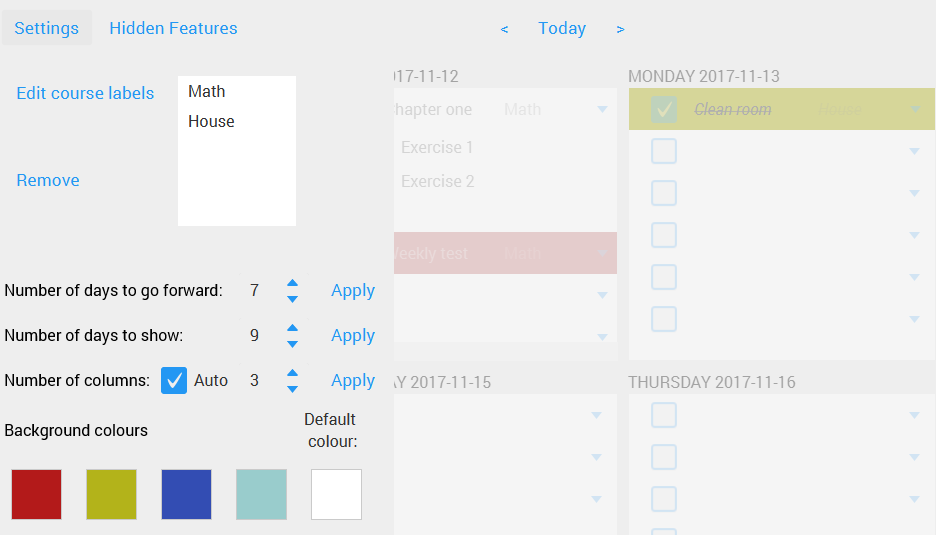

# Plep
Plepping is the new planning.
## [Download latest version](https://github.com/deltadak/plep/releases)

Plep works like a real agenda, but with the advantages of your Windows computer.

[Download stable version v1.2.2.](https://github.com/deltadak/plep/releases/download/v1.2.2/plep_v1.2.2.jar)

[Download the experimental windows installer for v1.2.1.](https://github.com/deltadak/plep/releases/download/v1.2.1/setup_plep_v1.2.1.exe)

We try to adhere to [Semantic Versioning](http://semver.org/). An update with a new first number means it won't work with your old database.

## Features
+ Drag and drop
+ Custom labels
+ Subtasks
+ Custom colours
+ Repeat for x weeks
+ Customize number of days and columns
+ Turn pages by a custom amount of days
+ Deletion and undoing deletion
+ Plep will remember all deleted tasks until you close it.

Note: The first time plep is ran, it will create a database file in the folder where the jar is stored. Check for this file, otherwise your data won't be saved. You can backup this if you don't want to lose your data.

## Screenshot of v2.0.0

### Settings of v2.0.0

## Instructions for building from source in IntelliJ
* To run or debug, use the Gradle task `run`.
* To build an executable jar, use the task `build`, the file is then in `build/libs/`.

## Building a release
* Run the gradle task launch4j/createExe 
* Open InnoSetup on your setup file in `releasing/innoSetup/*.iss`
* Update the version number
* Click Build | Compile

## [Javadoc](http://htmlpreview.github.io/?https://github.com/deltadak/plep/blob/master/Javadoc/index.html)